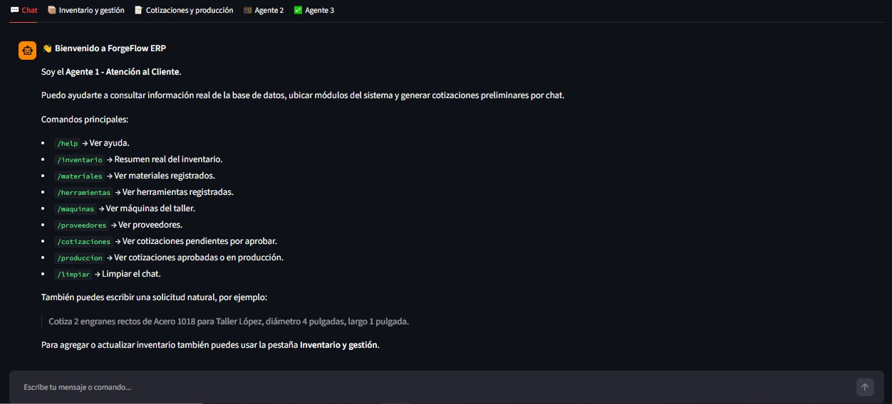
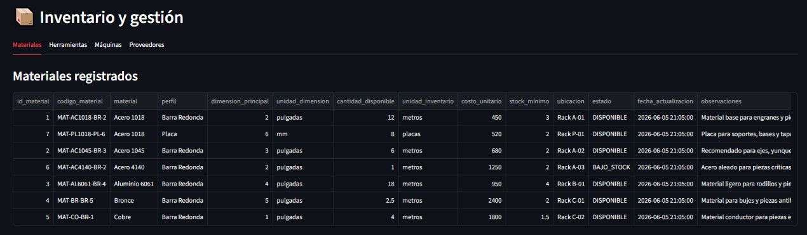
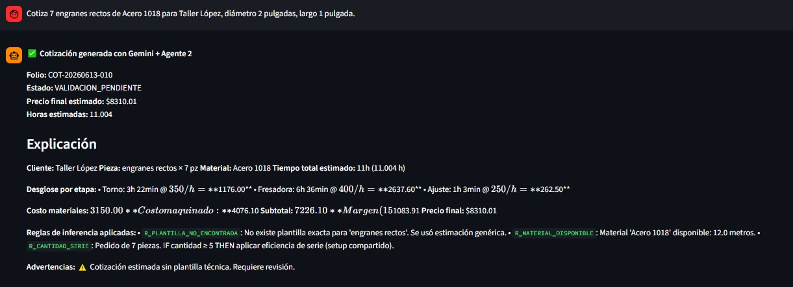
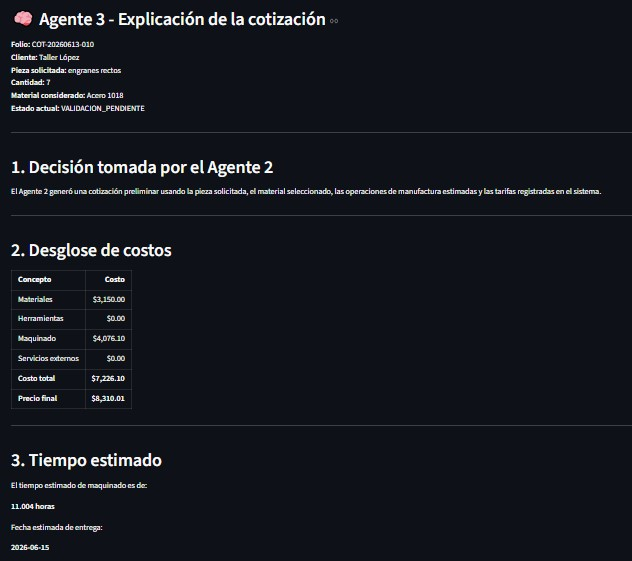
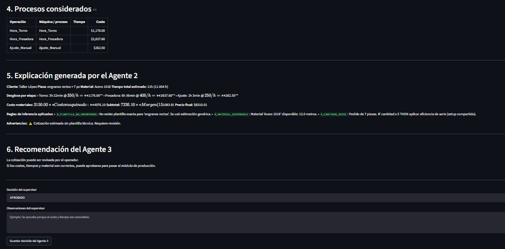

# SE-Proyecto-Final-Multiagente

# ForgeFlow ERP

Sistema Experto Multiagente para Gestión Operativa, Cotizaciones e Inventario en Talleres de Manufactura.

## Descripción

ForgeFlow ERP es un sistema experto multiagente desarrollado para talleres de manufactura, torno y fresadora.

El sistema permite consultar inventario, materiales, herramientas, máquinas, proveedores y clientes mediante lenguaje natural o comandos específicos, además de generar cotizaciones técnicas con explicación detallada del proceso de inferencia utilizado.

El proyecto fue desarrollado como parte de la asignatura de Sistemas Expertos.

---

# Objetivo

Desarrollar un sistema experto multiagente capaz de:

* Interpretar solicitudes del usuario.
* Consultar información almacenada en una base de datos SQLite.
* Generar cotizaciones técnicas.
* Explicar el razonamiento utilizado para generar dichas cotizaciones.
* Facilitar la validación y supervisión de decisiones.

---

# Arquitectura Multiagente

## Agente 1 — Atención e Interpretación

Responsabilidades:

* Recibir mensajes del usuario.
* Interpretar comandos.
* Interpretar lenguaje natural utilizando Gemini.
* Consultar información de la base de datos.
* Solicitar generación de cotizaciones.

Ejemplos:

* Mostrar inventario.
* Mostrar materiales.
* Mostrar proveedores.
* Mostrar clientes.
* Solicitar una cotización.

---

## Agente 2 — Motor de Inferencia

Responsabilidades:

* Analizar la solicitud de cotización.
* Seleccionar plantilla de manufactura.
* Calcular tiempos de proceso.
* Estimar costos de material.
* Estimar costos de maquinado.
* Aplicar reglas de inferencia.
* Generar hoja de ruta preliminar.

Salidas:

* Costo estimado.
* Tiempo estimado.
* Fecha estimada de entrega.
* Explicación técnica.

---

## Agente 3 — Supervisor y Explicador

Responsabilidades:

* Analizar resultados generados por el Agente 2.
* Explicar decisiones tomadas.
* Mostrar desglose de costos.
* Validar cotizaciones.
* Aprobar o cancelar órdenes.

---

# Capturas del Sistema

## Pantalla Principal

La pantalla principal corresponde al Agente 1 (Atención e Interpretación), donde el usuario puede interactuar mediante lenguaje natural o comandos específicos para consultar información del sistema.



---

## Gestión de Inventario

Módulo de consulta y administración del inventario del taller. Permite visualizar materiales, herramientas, máquinas y proveedores registrados en la base de datos.



---

## Generación de Cotizaciones

Vista del Agente 2 (Motor de Inferencia), encargado de analizar la solicitud del cliente, estimar tiempos de manufactura, calcular costos y generar una cotización preliminar.



---

## Agente 3 - Supervisor y Explicador

El Agente 3 analiza la información generada por el Agente 2, mostrando una explicación detallada de la toma de decisiones, los costos considerados y las reglas de inferencia aplicadas.

### Explicación de la Cotización



### Validación y Supervisión

El supervisor puede aprobar, cancelar o enviar una cotización a producción, registrando además observaciones y validaciones realizadas.



---

# Tecnologías Utilizadas

* Python
* Streamlit
* SQLite
* Google Gemini API
* Pandas

---

# Base de Datos

La información es almacenada mediante SQLite.

Tablas principales:

* Inventario_Taller
* Inventario_Herramientas
* Maquinas_Taller
* Tarifas_Taller
* Plantillas_Piezas
* Proveedores_Taller
* Reglas_Inferencia
* Historial_Inferencias
* Cotizaciones_Ordenes
* Ordenes_Compra
* Usuarios_Internos

---

# Instalación

Instalar dependencias:

```bash
pip install -r requirements.txt
```

Configurar archivo `.env`:

```env
GEMINI_API_KEY=TU_API_KEY
```

---

# Ejecución

```bash
python seed.py
```

```bash
streamlit run app.py
```

---

# Comandos Disponibles

* /help
* /inventario
* /materiales
* /herramientas
* /maquinas
* /proveedores
* /clientes
* /cotizaciones
* /produccion
* /limpiar

También pueden utilizarse consultas mediante lenguaje natural.

Ejemplos:

* Dame la lista de clientes.
* Muéstrame los materiales disponibles.
* ¿Qué proveedores tengo registrados?
* Cotiza un engrane recto de acero 1018 para Taller López.

---

# Estado Actual

Versión prototipo funcional.

Características implementadas:

* Consulta de información mediante chat.
* Integración con Gemini.
* Generación de cotizaciones.
* Explicación de decisiones.
* Validación mediante agente supervisor.

Posibles características futuras:

* Registro de nuevos elementos desde lenguaje natural.
* Generación automática de órdenes de compra.
* Reportes PDF.
* Dashboard de producción.
